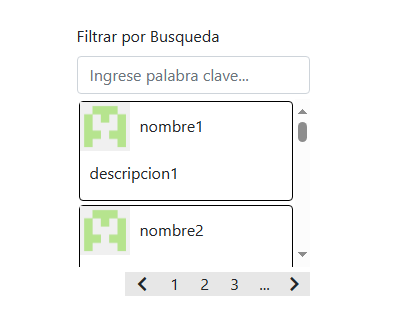

# Buscador Dinamico

# V1 BETA

# OBJETIVOS

1- ✅ Crear estructura html por defecto  
2- ✅ Crear funcion que cargue contenedor de items con un objeto data  
3- ✅ Crear funcion que sea capaz de indexar las busquedas en caso de que no existan datos en el objeto data  
4- ✅ Crear paginacion  
5- ✅ Que la paginacion detecte su contenedor, si no que se cree  
6- ✅ Que la paginacion pueda permitir un minimo de 3 paginas iterables  
7- ✅ Que al darle click a los numeros de cada pagina se visualicen solo esos items  
8- ✅ Que sea 10 items por pagina  
9- ✅ Que la paginacion adicionalmente pueda usar atras o siguiente  
10- Que la paginacion permita desplazar entre paginas si es que hay mas de 3 paginas para indexar  
?- Trabajar el ajax  
?- Montarlo en un CDN  
